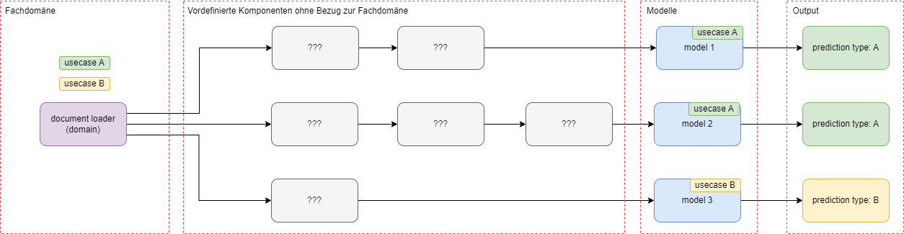
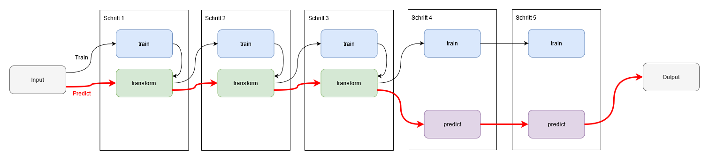

# Die Temi-Box: <br>Analyse und Erschließung von Textdaten in Python

Die Text Mining Toolbox, kurz `temibox`, unterstützt Sie bei der Analyse und Erschließung von Textdaten in Python. 
Basierend auf gängigen Frameworks und Bibliotheken wie `pytorch`, `transformers` und `spaCy`, löst die Temi-Box fachliche Aspekte aus den Machine Learning Prozessen heraus. 
Verschiedene Methoden zum Text Mining stehen als vorgefertigte Komponenten zur Verfügung und können direkt in eine Pipeline integriert werden. 
Damit lassen sich Entwicklung und Implementierung zum Text Mining erheblich vereinfachen. 

Wir geben hier einen Überblick über 
- [die Zielgruppen](#zielgruppen)
- [die Einsatzgebiete](#einsatzgebiete)
- [die Temi-Box Pipeline](#temi-box-pipeline)
- [die Komponenten der Temi-Box](#ordnerstruktur)
- [die Funktionsweise der Komponenten](#funktionsweise)

## Zielgruppen

Die `temibox` findet für verschiedenen Zielgruppen den Kompromiss zwischen Benutzerfreundlichkeit, Flexibilität und Leistung:

- Wenn Sie **ins Text Mining einsteigen**, stehen Ihnen vordefinierte Vorlagen, die [Blueprints](04_blueprints.md), zur Verfügung. Damit können Sie sich
komplett auf Ihre fachlichen Themen konzentrieren, alles Übrige ist vordefiniert. Für einfache Anwendungsfälle ist das ausreichend.

- Wenn Sie bereits **Erfahrung im Text Mining** gesammelt haben, können Sie mit der Temi-Box eine [Pipeline aus Standardkomponenten](03_step_by_step.md) nach Ihren Vorstellungen konfigurieren. 
Die Pipeline kann sich aus mehreren Komponenten, einem oder mehreren (Prognose-)Modellen oder fachlichen Themen zusammensetzen. 

- Für **Experten** stellt die Temi-Box [Schnittstellen](08_extensibility.md) zur Verfügung, um individuelle Komponenten, Modelle oder sogar Pipelinelogiken zu implementieren. 
Damit lassen sich auch sehr komplexe Aufgabenstellungen bearbeiten. 

 
## Einsatzgebiete

Der Schwerpunkt der Temi-Box im Text Mining liegt auf
- Textklassifikation = Zuordnen von Texten zu Klasse(n) 
    - Die Temi-Box unterstützt verschiedenste Arten von Textklassifikation.
    - Anwendungsbeispiele: Zuordnen von Themen oder Schlagwörtern zu Texten
- Textclustering = automatische Gruppierung ähnlicher Texte
    - Die Temi-Box liefert Basisfunktionalitäten zum Clustern von Texten.
    - Anwendungsbeispiele: Segmentierung wissenschaftlicher Texte


## Temi-Box Pipeline

Die Temi-Box bietet eine Pipeline, durch die sich die Abfolge der Verarbeitungsschritte für die Textdaten einfach festlegen lässt. 
Die Schritte sind modular in Form von Komponenten aufgebaut. 
Wie eine Pipeline mit mehreren Anwendungsfällen aussehen könnte, zeigt diese Grafik:



- **Fachdomäne:** Zentral für die Temi-Box sind die Komponenten der Fachdomäne. 
In diesen Komponenten werden alle Informationen gebündelt, die für den konkreten Anwendungsfall spezifisch sind, z. B. welche Daten werden für das Training verwendet, wie werden sie geladen oder was wird prognostiziert.

- **Vordefinierte Komponenten ohne Bezug zur Fachdomäne:** Alle übrigen Komponenten greifen bei Bedarf auf die Komponenten der Fachdomäne zu, sind aber selbst anwendungsfallneutral. 
Beispiele sind Preprocessor, Embedder und Trainer.
Alle anwendungsfallneutralen Komponenten sind vordefiniert. Sie können je nach Anwendungsfall unverändert, angepasst oder erweitert in die Pipeline integriert werden.

- **Modelle:** Abhängig vom konkreten Anwendungsfall folgen in der Pipeline meist ein oder mehrere Prognosemodelle. Beispiele dafür sind
     * Klassifizierung des Textes in eine der vorhandenen festen Gruppen
     * Themengenerierung (`...Text... -> Finanznachrichten`)
     * Zusammenfassung des Textes
     * Verschlagwortung des Textes (`...Text... -> [IAB, Wissenschaft, Wirtschaft]`)
     * Übersetzung des Textes in eine andere Sprache
     * Beantwortung einer Frage mit einem Textausschnitt (`Die Arbeitslosenquote stieg im September um [0.23 Prozentpunkte]`)
     * Part-of-Speech Tagging (`Berlin ist groß -> [PNOUN], [VERB], [ADJ]`)
     * Aufbau eines Wissensgraphes (`Berlin -[ist Hauptstadt]-> Deutschland`)
     * Suche in oder nach ähnlichen Dokumenten (`Information retrieval`)
     * Identifikation von Namen und Orte (`...Text... -> [Scholz, Berlin]`)
     * Referenzidentifikation (`Maria war müde. Sie hat aber trotzdem ihre Schwester besucht. -> [Sie: Maria]`)

- **Output:** Auf Basis des Modells werden die Prognosen erstellt. 
Falls die Prognosen für eine Anwendung bereitgestellt werden, können sie in der Output-Schicht formatiert werden (z.B. als JSON-Zeichenkette für eine Web-Anwendung).


## Ordnerstruktur

Die Ordnerstruktur zeigt die verschiedenen Komponenten der Temi-Box im Überblick:

```shell
temibox
├─── blueprint       # Vorgefertigte Pipelines
├─── cache           # Cache Klasse
├─── domain          # Klassen für die Implementierung der Fachdomäne
├─── embedder        # Standard BERT-Embedder, sowie generischer Embedder
├─── evaluation      # Evaluation der Prognose-Performance
│    └─── metric     # Performance-Metriken
├─── losses          # Verlustfunktionen
├─── model           # Modelle
│    ├───classifier  # Modelle für Textklassifizierung
│    ├───searcher    # Modelle für semantische Suche (WIP)
│    ├───summarizer  # Modelle für Textzusammenfassung (WIP)
├─── pipeline        # Standardpipeline
├─── preprocessor    # Verschiedene Funktionen für Textbereinigung
├─── tokenizer       # Standard BERT-Tokenizer
├─── trainer         # Standardtrainer für neuronale Netze
├─── vectorizer      # Standard BERT-Vectorizer
│
├─── capabilities.py # Sekundäre Fähigkeiten
├─── interfaces.py   # Schnittstellen zur Erweiterung von temibox
├─── prediction.py   # Wrapperklassen für Vorhersagen
└─── traits.py       # Primäre (pipeline-relevante) Fähigkeiten
```


## Funktionsweise

Die wichtigsten Methoden zur Berechnung der Pipeline sind `.train()`, `.transform()`und `.predict()`. 
Entsprechend dazu können die Komponenten die Fähigkeiten `trainable`, `transformable` und `predictable` besitzen.

- **Trainineren**: Die Pipeline wird mithilfe der `.train()`-Methode trainiert. 
Dabei werden alle Komponenten der Pipeline, die über die Fähigkeit `trainable` oder `transformable` verfügen, in einer festgelegten Reihenfolge ausgeführt. 
Diese Reihenfolge entspricht der Anordnung der Komponenten innerhalb der Pipeline. 
Innerhalb jeder Komponente wird zunächst die `.train()`-Methode und anschließend die `.transform()`-Methode aufgerufen. Die `.transform()`-Methode stellt die Daten in der Form zur Verfügung, wie sie die nächste Komponente braucht.

- **Transformieren**: Die `.transform()`-Methode transformiert die Eingabe für jede Komponente mit der Fähigkeit `transformable`. 

- **Vorhersagen**: Die `.predict()`-Methode liefert Vorhersagen.
Dazu wird die `.transform()`-Methode jeder Komponente mit der Fähigkeit `transformable` ausgeführt, anschließend die `predict`-Methode jeder Komponente mit der Fähigkeit `predictable`.

Hier ist ein Beispiel, wie die Verarbeitung ablaufen kann: 



