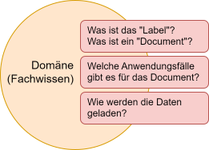

# Fachdomäne

Ein zentraler Vorteil für die Nutzung der `temibox` liegt in der Trennung von Fachdomäne und Machine Learning.
Die Fachdomäne, also das Dokument und seine Anwendungsfälle, steuert die Pipeline, nicht umgekehrt.




Die Fachdomäne beschreibt alle Gegenstände und Konzepte, die für die Abbildung der Domäne in einer Pipeline notwendig sind.
Für die temibox müssen in der Fachdomäne das Document, der Anwendungsfall und der Dokumentlader definiert werden.


## Definition des Documents

Der erste Schritt ist die Definition eines passenden Documents für Ihren Anwendungsfall.

#### Was ist ein "Document" in der Domäne?

Die Rohdaten, die für das Text Mining zur Verfügung stehen, setzen sich aus einzelnen Beobachtungen oder Datensätzen, den Beispielen, zusammen. 
Diese Beispiele werden später im Training verwendet, um Muster und Beziehungen zu lernen. 
Das "Document" der Fachdomäne listet alle Merkmale eines Beispiels auf, die für den Anwendungsfall relevant sind, also z. B. Titel, Abstrakt, Themen, Schlagwörter oder Autoren.

#### Wie wird das "Document" implementiert?

Umgesetzt wird das "Document" als Datenklasse (`dataclass`) mit frei wählbarem Namen. Die Klasse enthält nur Felder, die fachlich relevant sind.
Methoden der Klasse, z. B. zum Laden oder Speichern der Documente, werden standardmäßig von `temibox` Komponenten nicht verwendet.
Ein Document "MeinDocument" kann beispielsweise so umgesetzt werden:

```python
from dataclasses import dataclass
from temibox.domain import Label

@dataclass
class MeinDocument:
    titel: str
    text: str
    sprache: Label
    themen: list[Label]    
```

Die Umsetzung als Datenklasse ist empfehlenswert, da das Document ein reiner Datenträger ist und über keine weitere Funktionalität
verfügen muss. Grundsätzlich könnte das Document auch als Klasse, Tupel, o.ä. dargestellt werden.

#### Beispielanwendungsfall "Themenklassifizierung für wissenschaftliche Publikationen"

Da wir in unserem Beispielanwendungsfall mit der Klassifizierung von wissenschaftlichen Publikation zu tun haben, 
nennen wir das Document `Publikation`. Wir nehmen an, dass eine Publikation über folgende Felder verfügt:
- Titel (`titel`)
- Zusammenfassung (`abstract`)
- Liste der Schlagwörter (`schlagwoerter`)
- Liste von numerischen Themen IDs (`themen_ids`)

Aus dieser Definition entsteht folgendes Document:

```python
from dataclasses import dataclass

@dataclass
class Publikation:
    titel:         str
    abstract:      str
    schlagwoerter: list[str]
    themen_ids:    list[int]
``` 


## Definition des Anwendungsfalls

#### Welche Anwendungsfälle (`UseCase`) gibt es für das Document?

Machine Learning unterscheidet zwei Arten von Anwendungsfällen:
- Supervised Learning: Werden anhand der Rohdaten Werte vorhergesagt, werden die Merkmale oder Variablen der Rohdaten unterteilt in Zielvariablen, den sog. Labels, und Eingangsvariablen, den sog. Features. 
Die Labels werden anhand der Features vorhergesagt. Diese Art des Lernens heißt "Supervised Learning". 
Typische Anwendungsfälle im Text Mining sind Themenzuordnung, Verschlagwortung, Zusammenfassung oder Extraktion von Entitäten (NER).
- Unsupervised Learning: Werden innerhalb der Rohdaten Muster und Strukturen entdeckt, ohne dass Labels genutzt werden, spricht man von "Unsupervised Learning".
Typische Anwendungsfälle im Text Mining sind das Finden ähnlicher Dokumente.

In der temibox beschreibt ein Anwendungsfall, wie aus einem Document Inhalt und Labels der Beispiele extrahiert werden können. Im Supervised Learning werden zusätzlich die Labels (Zielvariablen) definiert.
- Für ein Document können mehrere Anwendungsfälle definiert werden. Relevante Inhalte und Labels können je nach Anwendungsfall unterschiedlich sein.
- Wenn für die Labels zusätzliche Quellen verwendet werden, die im Document nicht aufgeführt sind (z.B. Labelkataloge), werden diese Quellen ebenfalls im Anwendungsfall implementiert.


#### Wie wird der "Anwendungsfall" implementiert?

Zur Beschreibung Ihres Anwendungsfalls legen Sie im Vorfeld einige Punkte fest. 
- Name des Anwendungsfalls (`MeinAnwendungsfall`): Der Name des Anwendungsfalls muss in der Pipeline eindeutig sein.
- Features / Labels der einzelnen Beispiele: Die Felder des Documents (`MeinDocument`) werden getrennt in Felder, 
	* die für die Bildung der Features eines Beispiels verwendet werden (`get_document_body`), 
	* die als Label eines Beispiels genutzt werden (`get_document_labels`) und 
	* die als Label-ID eines Beispiels eingesetzt werden (`get_document_label_ids`).
- weitere Daten zu Labels: Welche weiteren Datenquellen sollen für die Labels berücksichtigt werden?

Sie implementieren den Anwendungsfall, indem Sie die neue Klasse `MeinAnwendungsfall` erstellen, die von der Klasse `temibox.domain.UseCase` erbt.
Definieren Sie alle geerbten Methoden entsprechend der Fachlichkeit. Für nicht relevante Methoden reicht eine Umsetzung mit `pass`.
Ein Anwendungsfall `MeinAnwendungsfall` kann beispielsweise so umgesetzt werden:

```python
from temibox.domain import Label, Triplet, UseCase

class MeinAnwendungsfall(UseCase):
    
    @property
    def name(self) -> str:
        return "mein_anwendungsfall"

    def get_document_body(self, document: MeinDocument) -> str:
        return ". ".join(document.titel, document.text)

    def get_document_labels(self, document: MeinDocument) -> list[Label]:
        return [document.sprache]

    def get_document_label_ids(self, document: MeinDocument) -> list[int]:
        ... Implementierung ...

    def get_usecase_labels(self) -> list[Label]:
        ... Implementierung ...
    
    # optional, falls das Klassifizierungsmodell `BinaryClassifier` verwendet wird
    def get_usecase_label_dict(self) -> dict[int, Label]:
        pass

    # optional, falls beim Training eine gewichtete Verlustfunktion eingesetzt wird,
    # liefert die Methode ein "Gewicht" per Ausprägung der Zielvariable
    def get_usecase_label_weights(self) -> dict[Label, float]:
        pass

    # optional, falls die Verlustfunktion `MultilabelBinaryLoss` verwendet wird, 
    # liefert die Methode eine zufällig generierte Menge von positiven und negativen Ausprägungen der Zielvariable
    def create_document_test_labels(self, document: MeinDocument, positive: int, negative: int) -> list[
        tuple[(Label, bool)]]:
        pass

    # optional, falls die Verlustfunktion `TripletLossStrategy` verwendet wird, 
    # liefert die Methode eine Menge von Triplets (ein Tupel mit einem positiven Beispiel, einem Basis-Beispiel 
    # (d.h. dem Text auf deren Basis entschieden wird was positiv und was negativ ist), und einem negativen Beispiel)
    def create_document_triplet(self, document: MeinDocument, examples: int = 1) -> list[Triplet]:
        pass
```

#### Beispielanwendungsfall "Themenklassifizierung für wissenschaftliche Publikationen"

```python
import json
from temibox.domain import UseCase, Label

class ThemenKlassifizierung(UseCase):

    def __init__(self, 
                 label_json_path: str = "data/labels.json"):
      
        with open(label_json_path, "r") as f:
            self._label_dict = json.load(f)
  
    @property
    def name(self) -> str:
        return "themenklassifizierung"

    def get_document_body(self, document: Publikation) -> str:
        return ". ".join([document.titel, *document.schlagwoerter, document.abstract])

    def get_document_labels(self, document: Publikation) -> list[Label]:
        return [self._label_dict[tid] for tid in document.label_ids if tid in self._label_dict]

    def get_document_label_ids(self, document: Publikation) -> list[int]:
        return document.label_ids

    def get_usecase_labels(self) -> list[Label]:
        return list(self._label_dict.values())

    def get_usecase_label_dict(self) -> dict[int, Label]:
        return self._label_dict.copy()

    def get_usecase_label_weights(self) -> dict[Label, float]:
        """Wird hier nicht gebraucht"""
        pass

    def create_document_test_labels(self, document: Publikation, positive: int, negative: int) -> list[tuple[(Label, bool)]]:
        """Wird hier nicht gebraucht"""
        pass

    def create_document_triplet(self, document: Publikation, examples: int = 1) -> list[Triplet]:
        """Wird hier nicht gebraucht"""
        pass

```

## Definition des Datenladers

#### Was macht der Datenlader?

Der Datenlader lädt die benötigten Daten aus Dateien oder Datenbanken, 
extrahiert die für den Anwendungsfall benötigten Daten entsprechend der Definition im "Document"
und erzeugt daraus eine Menge von Objekten. Diese Menge wird im Rahmen der Pipeline für das Training der Modelle 
und Evaluation der Prognoseperformance verwendet werden.
Zusätzlich kann der Datenlader optional Texte normalisieren und/oder bereinigen (Preprocessing). 

Üblicherweise ist der Datenlader der erste Schritt der Pipeline. 
Eine Umsetzung des Datenladers außerhalb der Pipeline ist unter den [Advanced Pipelines](06_advanced_pipelines.md) beschrieben.

#### Wie wird der Datenlader als Pipeline-Schritt implementiert?

Zur Implementierung des Datenladers als Pipeline-Schritt wird eine beliebige Klasse als Subtyp der abstrakten Klasse `temibox.traits.PipelineStep` erstellt.
Die Klasse braucht mindestens die Fähigkeiten `Trainable` und `Transformable`. Der Datenlader trifft keine Vorhersagen, die Fähigkeit `Predictable` ist deshalb nicht notwendig.


#### Beispielanwendungsfall "Themenklassifizierung für wissenschaftliche Publikationen"

Die Rolle der Klassenmethoden ist direkt im Code dokumentiert.


```python
import os
from temibox.traits import Trainable, Transformable, Cleanable
from temibox.context import Context
from typing import Optional, Any

class PublikationenLader(Trainable, Transformable, Cleanable):
    
    def __init__(self):
        super().__init__()
        self._pubs = []
    
    def train(self, 
              ctx:          Optional[Context] = None,
              pub_json_dir: str = "data/",
              max_pubs:     int = -1,
              **kwargs) -> None:
        """
        Die Fähigkeit `Trainable` ist bei einem Datenlader optional.
        Es ist möglich die Daten schon bei der Initialisierung (`__init__`),
        oder sogar direkt in dem Transformationsschritt (`transform`) zu laden.
        
        Falls man die Daten, wie hier dargestellt, im Trainingsschritt lädt
        und intern speichert (self._pubs), dann muss auch die Fähigkeit `Cleanable`
        geerbt und die Methode `clean` implementiert werden, da die Pipeline
        diese temporären Daten vor dem Pipeline-Export löschen können sollte.
        
        In allen Pipelinemethoden (d.h. von den Fähigkeiten Trainable, Transformable, usw.
        geerbte Methoden), darf man beliebig viele zusätzliche Parameter aufnehmen, solange
        ihnen Standardwerte (inkl. None) zugeordnet werden. Hier definieren wir zwei
        solche Parameter:
        - pub_json_dir - Pfad zu dem Ordner, wo Publikationen im JSON-Format gespeichert werden
        - max_pubs - maximale Anzahl an zu ladenden Publikationen
        
        Um den Code nicht zu wiederholen, nutzen wir die Methode aus dem unabhängigen Datenlader
        """
        
        self._pubs = PublikationenLaderUnabhaengig.lade_publikationen(pub_json_dir = pub_json_dir,
                                                                      max_pubs = max_pubs)

    def transform(self, 
                  ctx: Optional[Context] = None, 
                  title: str = None,
                  abstract: str = None,
                  keywords: list[str] = None,
                  documents: Publikation | list[Publikation] = None,
                  **kwargs) -> dict[str, Any]:
        """
        Die Aufgabe der `.transform()`-Methode ist die Transformation der Eingabe.
        Für seine primäre Aufgabe (Laden der Trainingsdaten), muss der Datenlader 
        nichts transformieren, da er zu diesem Zeitpunkt seine Daten schon geladen
        und intern gespeichert hat. Falls aber der Pipeline nicht eine Publikation,
        sondern die einzelnen Teile (Titel, Abstract, Schlagwörter) übergeben wurden,
        sollte er eine Publikation bauen und nur diese Publikation weitergeben.
        
        So kann man die Pipeline später bequem für Prognosen einsetzen (Transformationen
        der Eingabe ist die erste Phase der Prognosepipeline).
      
        Obwohl es in unserem Beispiel um Publikationen geht, nennen wir die Variable, die die Publikationen 
        enthalten soll, "documents". Dies liegt daran, dass die Standardkomponenten, wie der Embedder, mit 
        "documents" arbeiten und eine Variable namens "document" oder "documents" erwarten.
        
        Wir priorisieren die Ausgabe wie folgt:
        - Falls die Einzelteile (oder mindestens titel/abstract) der Publikation vorhanden sind, 
          geben wir die neu gebaute Publikation aus
        - Falls ein oder mehrere Dokumente eingegeben wurden, reichen wir diese Dokumente einfach weiter
        - Falls nichts eingegeben wurde und die Pipeline noch trainiert wird (das gibt uns die
          Pipelineproperty `is_training` wieder), dann reichen wir die ganzen Trainingsdaten weiter
        - Ansonsten wird eine Fehlermeldung ausgegeben und die Ausführung stoppt.
        """
        
        if title or abstract:
          return {"documents": [Publikation(titel = title,
                                            abstract = abstract,
                                            schlagwoerter = keywords if keywords is not None else [],
                                            themen_ids = [])]}
        
        elif documents is not None:            
            return {"documents": documents if len(documents) else [documents]}
            
        elif len(self._pubs) and ctx is not None and ctx.pipeline.is_training:
            return {"documents": self._pubs.copy()}
        else:
            raise Exception("Fehlende Eingabe - keine Dokumente")
    
    def clean(self) -> None:
        """
        Pipelineschritte, die intern transiente Daten speichern
        sollten die Fähigkeit `Cleanable` implementieren, da diese
        Fähigkeit die Pipeline vor einem Export (Speichern
        auf der Festplatte) die nicht mehr benötigten Daten 
        aufzuräumen ermöglicht
        """
        self._pubs = []

```
