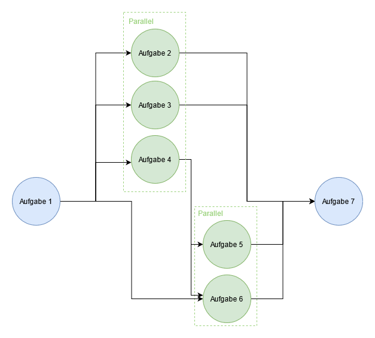

# Fortgeschrittene Pipelines

Komplexere Anwendungsfälle können es notwendig machen, dass fortgeschrittene Techniken und Methoden zur Erstellung der Pipeline eingesetzt werden. 
Zunächst werden wir anhand eines konkreten Beispiels verschiedene Funktionalitäten implementieren, 
um die grundlegenden und erweiterten Schritte einer NLP-Pipeline zu veranschaulichen. 
Anschließend zeigen wir, wie Signaturen genutzt werden können, um die Komplexität der Pipeline besser zu überblicken und zu managen. 
Abschließend stellen wir weitere Anpassungsmöglichkeiten vor, wie die parallele Ausführung von Schritten und das Laden von Daten außerhalb der Pipeline. 
Durch diese umfassende Betrachtung erhalten Sie ein tiefgehendes Verständnis für die Entwicklung und Optimierung fortgeschrittener NLP-Pipelines.

## Implementierung fortgeschrittener Funktionalitäten

Hier ist ein Beispiel einer fortgeschrittenen Pipeline, die die meisten Funktionalitäten
der `temibox` veranschaulicht. Im Anschluss werden die Funktionalitäten näher erläutert.

```python
from temibox.pipeline import StandardPipeline
from temibox.trainer import StandardTrainer
from temibox.embedder import BertEmbedder
from temibox.model.classifier import BinaryClassifier

TrainPlan = StandardTrainer.Trainplan

from .domain import MeinAnwendungsfall_1, MeinAnwendungsfall_2
from .domain import MeinDatenlader, MeinDocument, EnsembleModel

pipeline = (StandardPipeline() \

                # Anwendungsfälle
                .add_usecase(uc_1 := MeinAnwendungsfall_1())
                .add_usecase(uc_2 := MeinAnwendungsfall_2())

                # Daten
                .add_step("daten", MeinDatenlader())

                # Embedder
                .add_step("embedder", BertEmbedder(pretrained_model_dir = "modelle/distilbert"))                
                
                # Einfache Modelle - Anwendungsfall 1
                .add_step("model-1", BinaryClassifier(multilabel = True), usecases=[uc_1], dependencies = ["embedder"])
                .add_step("model-2", BinaryClassifier(multilabel = True), usecases=[uc_1], dependencies = ["embedder"])

                # Einfache Modelle - Anwendungsfall 2
                .add_step("model-3", BinaryClassifier(multilabel = True), usecases=[uc_2], dependencies = ["embedder"])
                .add_step("model-4", BinaryClassifier(multilabel = True), usecases=[uc_2], dependencies = ["embedder"])
                
                .add_step("trainer", StandardTrainer())
                          
                # Ensemble Modelle
                .add_step("ensemble-1", EnsembleModel(multilabel = True), 
                                        dependencies = ["daten",
                                                        "model-1", 
                                                        "model-2"],
                                        usecases = [uc_1])

                .add_step("ensemble-2", EnsembleModel(multilabel = True), 
                                        dependencies = ["daten",
                                                        "model-3", 
                                                        "model-4"],
                                        usecases = [uc_2])

                .add_step("trainer-ensemble", StandardTrainer(), dependencies = ["daten", "ensemble-1", "ensemble-2"]))

# Training
trainplans = [
    TrainPlan(epochs = 1,
              learn_rate = 1e-3,
              batch_size = 16,
              freeze_vectorizer = True,
              max_docs = -1,
              break_early = False,
              reset_break_early_score = False),

    TrainPlan(epochs = 10,
              learn_rate = 1e-6,
              batch_size = 8,
              freeze_vectorizer = False,
              max_docs = -1,
              break_early = True,
              reset_break_early_score = False)
]

pipeline.train(pub_json_pfad = "daten/meinedaten",
               trainplans    = trainplans)

# Vorhersage
with pipeline.modes(inference = True, cuda = True):
    prognosen = pipeline.predict(document = MeinDocument(inhalt = "Das ist nur ein Beispiel"),
                                 min_score = 0.75,
                                 max_predictions = 10)
```


### Mehrere Anwendungsfälle

Die Pipeline enthält zwei Anwendungsfälle: `MeinAnwendungsfall_1` und `MeinAnwendungsfall_2`.
Aus Sicht der Pipeline ist es wichtig, dass sich die Anwendungsfälle in ihrer Bezeichnung (`UseCase.name`) voneinander unterscheiden.
Theoretisch ist es sogar möglich, die gleiche Klasse des Anwendungsfalls
mehrmals zu benutzen, solange jede Instanz einen eindeutigen Namen bekommt.

Es ist ebenfalls wichtig, sich die Instanzen der Anwendungsfälle zu merken. 
Falls später im Pipelineaufbau nicht alle Komponenten allen Anwendungsfällen zugeordnet werden sollen, 
wird eine Referenz auf die relevanten Instanzen benötigt. 
Dabei muss genau die Instanz des Anwendungsfalls (hier `uc_1` und `uc_2`) angegeben werden, die zuvor mit `Pipeline.add_usecase` hinzugefügt wurde.
Hintergrund: Es wird zwar empfohlen, die Klassen der Anwendungsfälle zustandsfrei zu implementieren, jedoch ist dies nicht zwingend vorgeschrieben. 
Es ist daher möglich, dass die Instanz eines Anwendungsfalls beispielsweise während des Trainingsprozesses 
durch eine referenzierende Komponente verändert wird. 
Wenn andere Komponenten eigene Instanzen des Anwendungsfalls referenzieren, könnten sie diese Änderungen verpassen.

### Embedder

Die Pipeline enthält nur einen Embedder. 
Obwohl sie für zwei Anwendungsfälle konzipiert ist, kann es sinnvoll sein, alle einfachen Modelle von einem einzigen Embedder abhängig zu machen. 
Dies ist besonders dann vorteilhaft, wenn die Anwendungsfälle sehr ähnlich sind, 
da sie vom gleichen Dokumententyp abhängen und somit Trainingssynergien entstehen können. 
Sollte dies jedoch nicht der Fall sein, ist es ratsamer, zwei unabhängige Pipelines zu erstellen.

### Einfache Modelle und Trainer

Die Pipeline umfasst vier "einfache" Modelle: 
Die ersten beiden sind dem ersten Anwendungsfall zugeordnet, die anderen beiden dem zweiten. 
Alle vier Modelle sind von einem einzigen Embedder abhängig. 
Zudem werden alle Modelle vom gleichen Trainer im selben Trainingsprozess trainiert. 
Dies ist in der Regel unproblematisch, da der Trainer im Wesentlichen nur Dokumentenbatches erzeugt und die Modellgewichte aktualisiert.

### Ensemble Modelle und Trainer

Nachdem die einfachen Modelle trainiert wurden, können Ensemble-Modelle (`EnsembleModel`) erstellt werden. 
Ensemble-Modelle verwenden die Prognosen anderer Modelle als Eingabe, nicht die ursprünglichen Daten. 

Hier überwacht jedes Ensemble-Modell zwei einfache Modelle sowie `daten`, 
da der Dokumentenlader je nach Implementierung eine wichtige Rolle im Prognoseworkflow spielen kann, 
beispielsweise durch die Erzeugung von Dokumentinstanzen aus Zeichenketten.

Die Ensemble-Modelle erfordern einen separaten Trainer, da sie erst nach den einfachen Modellen trainiert werden. 
Würde man dieselbe Trainer-Referenz verwenden, würde der Trainer der ursprünglichen Modelle gleichzeitig auch die Ensemble-Modelle trainieren. 
Das könnte zu einem langsameren oder schlechteren Training führen.

### Trainingsprozess

Der `StandardTrainer` führt sein Training basierend auf Trainingsplänen durch. 
Wenn ihm keine expliziten Trainingspläne übergeben werden, verwendet er vordefinierte Pläne. 
Soll der Trainingsprozesses angepasst werden, definiert man eine Liste von Instanzen des Typs `StandardTrainer.Trainplan` und 
gibt diese beim Aufruf von `pipeline.train(trainplans = ...)` an. 
Wenn man `pipeline.get_signature` ausführt, sieht man, dass es diese Möglichkeit gibt:

```
TRAIN:
> trainer
    documents  : Union[list[Document], ContextArg[list[Document]]] = None
    trainplans : Union[list[StandardTrainer.Trainplan], ContextArg[list[StandardTrainer.Trainplan]]] = None
```

### Vorhersagen

Im Prognoseworkflow ist es wichtig, die Pipeline in den Inferenzmodus zu versetzen. 
Dies kann entweder dauerhaft mit `pipeline.set_inference_mode` oder temporär für einen einzelnen Aufruf mittels `with pipeline.modes` erfolgen. <br>
Der Prognoseworkflow im Trainingsmodus hat mehrere Nachteile:
- Nicht-deterministische Prognosen: Wenn die Pipeline Modelle oder Embedder mit stochastischen Elementen wie `Dropout` enthält, sind die Prognosen nicht deterministisch.
- Langsamere Prognosen: Da die Gradienten weiterhin berechnet werden, sind die Prognosen langsamer.
- Höherer Speicherverbrauch: Der Arbeitsspeicher (insbesondere die GPU) wird stärker beansprucht, da die Gradienteninformationen akkumuliert werden.

## Nutzung von Signaturen bei komplexen Pipelines

Je mehr Komponenten eine Pipeline enthält, desto komplexer werden die Vorgänge und 
desto mehr Parameter haben Standardbefehle wie `train`, `transform`, `predict` und `evaluate`. 
Diese Komplexität nimmt zu, da die Befehle nicht nur direkte Eingaben, wie `pipeline.predict(min_score = 0.9)`, 
sondern auch Ausgaben von Transformationsschritten akzeptieren können. 

Eine hilfreiche Unterstützung bietet die Methode

**pipeline.get_signature()**
> listet Signaturen aller im Berechnungspfad involvierten Komponenten auf
>
>```python
>pipeline.get_signature(traits, per_step = None, as_string = True)
>```
>> Parameter:
>> - **traits** (list): Liste der Traits, für die die Signaturen aufgelistet werden sollen, z. B. Trainable, Predictable
>> - **per_step** (bool, optional): Angabe, ob Parameter auf Komponentenebene ausgegeben werden sollen
>> - **as_string** (bool): Angabe, ob Ausgabe als String erfolgen soll
>
> **Beispiel 1:**
>>```python
>>from temibox.traits import Transformable, Predictable
>>
>>print(pipeline.get_signature(Predictable, as_string = True))
>>
>># PREDICT:
>># 	binary_threshold    : float = 0.5
>># 	document            : Union[Document, ContextArg[Document]] = None
>># 	documents           : Union[list[Document], ContextArg[list[Document]]] = None
>># 	embeddings          : Union[torch.FloatTensor, ContextArg[torch.FloatTensor]] = None
>># 	label_dict          : Union[dict[int, Union[int, str]], ContextArg[dict[int, Union[int, str]]]] = {}
>># 	max_predictions     : int = 10
>># 	min_score           : float = 0.0
>>```
>
>Im Beispiel sind die Parameter `document`, `documents`, `embeddings` und `label_dict` kontextabhängig, sie können von Transformationsschritten erzeugt werden.
>Die Parameter `binary_threshold`, `max_predictions` und `min_score` erfordern eine direkte Eingabe. 
>Man erkennt auch, dass für die Erzeugung einer Vorhersage der Pipeline ein oder mehrere Dokumente oder die Worteinbettungen übergeben werden müssen – 
>nur eine Zeichenkette reicht nicht aus. 
>In anderen Pipelines, bei denen der Datenlader beispielsweise aus Zeichenketten selbst ein Dokument erzeugen kann, 
>würde dies ebenfalls ersichtlich werden, etwa durch einen Parameter wie `document_text: str`.
>
> Hinweis: Nur weil ein Parameter in der Signatur erwähnt wird, bedeutet das nicht, dass man ihn auch zwingend eingeben muss. 
> Viele Parameter, wie beispielsweise `max_predictions`, haben Standardwerte. 
> Andere Parameter, wie `embeddings`, können zwar vorgegeben werden, müssen es aber nicht, 
> da sie von anderen Komponenten – in diesem Fall vom Embedder – während der Transformationsphase erzeugt werden. 
> Was definitiv eingegeben werden kann, sind direkte Eingaben (Parameter ohne ContextArg-Anteil) sowie domänenspezifische Parameter wie `document`.
>
> **Beispiel 2 mit optionalem Flag `per_step = True`:**
>>```python
>>print(pipeline.get_signature(Predictable, per_step = True, as_string = True))
>>
>># PREDICT:
>># > embedder
>># 		document            : Union[Document, ContextArg[Document]] = None
>># 		documents           : Union[list[Document], ContextArg[list[Document]]] = None
>>#
>># > model
>># 		binary_threshold    : float = 0.5
>># 		embeddings          : Union[torch.FloatTensor, ContextArg[torch.FloatTensor]] = None
>># 		label_dict          : Union[dict[int, Union[int, str]], ContextArg[dict[int, Union[int, str]]]] = {}
>># 		max_predictions     : int = 10
>># 		min_score           : float = 0.0
>>```


## Erweiterte Anpassungsmöglichkeiten der Pipeline

### Daten außerhalb der Pipeline laden

Der Datenlader ist nicht zwingend Bestandteil der Pipeline. Es ist ausreichend, wenn er der Pipeline die Dokumente liefert. Er kann die Daten auch außerhalb der Pipeline laden.


**Daten innerhalb der Pipeline laden**: In der Regel ist es empfehlenswert, den Datenlader als ersten Schritt in die Pipeline aufzunehmen.
Dies gilt insbesondere, wenn er Aufgaben wie Textbereinigung, Validierung oder weitere Verarbeitungsschritte ausführt. 
Auf diese Weise wird sichergestellt, dass während der Nutzung der Pipeline die erforderlichen Bereinigungsprozeduren angewendet werden 
und es keine andere Möglichkeit gibt, Objekte des Dokumententyps zu initialisieren. 
Zudem ist die Pipeline in diesem Fall vollständig abgeschlossen und enthält die gesamte Logik.

**Daten außerhalb der Pipeline laden**: Statt die Daten als Pipeline-Schritt zu laden, können Dokumente auch manuell geladen und der Pipeline übergeben werden. 
In diesem Fall können die Bereinigungsprozeduren in den Konstruktor des Dokumententyps eingebaut werden, 
um zu vermeiden, dass ungültige oder unbereinigte Dokumente erzeugt und verwendet werden.

Hier ist ein Beispiel für einen unabhängigen Datenlader, der Daten außerhalb der Pipeline lädt:

```python
import os
from tqdm import tqdm

class PublikationenLaderUnabhaengig:
  
    @staticmethod
    def lade_publikationen(pub_json_dir: str = "data/",
                           max_pubs:     int = -1) -> list[Publikation]:
      
        """
        Die Methode läuft alle JSON-Dateien in dem Ordner `pub_json_dir` durch.
        Es werden nur Dateien, die mit "pub" anfangen und ".json" enden betrachtet. 
        """
        
        if not os.path.isdir(pub_json_dir):
            raise Exception(f"Ordner mit Publikationen '{pub_json_dir}' nicht gefunden")

        pubs = []
        for filename in tqdm(os.listdir(pub_json_dir), "Lade Publikationen"):
          if not (filename.startswith("pub_") and filename.endswith(".json")):
            continue
            
            with open(f"{pub_json_dir}/{filename}", r) as f:
                p = json.load(f)
                
            pubs.append(Publikation(titel         = p.titel, 
                                    abstract      = p.abstract,
                                    schlagwoerter = p.schlagwoerter,
                                    themen_ids    = p.themen_ids))
                
            if 0 < max_pubs == len(pubs):
              break
                
        return pubs
```


### Parallele Ausführung von Pipelineschritten

Pipelineschritte können auch parallel ausgeführt werden. Diese Funktionalität ist jedoch in der `temibox` standardmäßig nicht enthalten.


**Sequenzielle Ausführung**: In der Standardimplementierung wird beim Ausführen der einzelnen Schritte eine strikt sequentielle Vorgehensweise erzwungen. 
Die Schritte der Pipeline werden normalerweise in der Reihenfolge ausgeführt, in der sie in die Pipeline aufgenommen wurden. 
Das Ergebnis eines Schritts wird dann zusammen mit allen bisherigen Eingaben an den nächsten Schritt weitergegeben. 
Diese Ausführungsart wird als "sequentielle Ausführung" bezeichnet.
Wenn es eine Abhängigkeit zwischen jedem Schritt und dem zuvor ausgeführten Schritt gibt, ist diese Vorgehensweise sinnvoll.
Die meisten Pipelines kommen deshalb damit gut zurecht, da sie in der Regel eine einfache Abfolge von Schritten darstellen. 

**Parallele Ausführung**: Anders verhält es sich, wenn Schritte jedoch nicht voneinander abhängig sind, wie beispielsweise bei unabhängigen Prognosemodellen, 
wenn sie auf die Ausführung vorheriger Schritte warten müssen, obwohl sie deren Ergebnisse nicht benötigen.
Dann ist es effizienter, die unabhängigen Schritte gleichzeitig auszuführen und so Leerlaufzeiten zu reduzieren. 
Diese Ausführungsart wird als "parallele Ausführung" bezeichnet. Dazu kann die Pipeline als ein gerichteter azyklischer Graph aufgebaut werden:



Die Darstellung der Knoten (Schritte, Aufgaben) und Kanten (Abhängigkeiten) ermöglicht es, Aufgaben zu identifizieren, 
die parallel erledigt werden können. Die Reihenfolge, in der die Schritte ausgeführt werden, muss nicht der Reihenfolge beim Einfügen entsprechen. 
Die richtige Beschreibung der Abhängigkeiten kann jedoch die Ausführung der Pipeline insgesamt beschleunigen.

