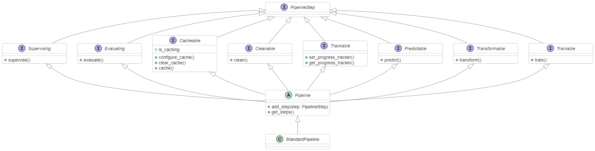
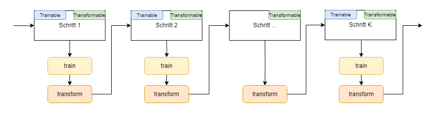
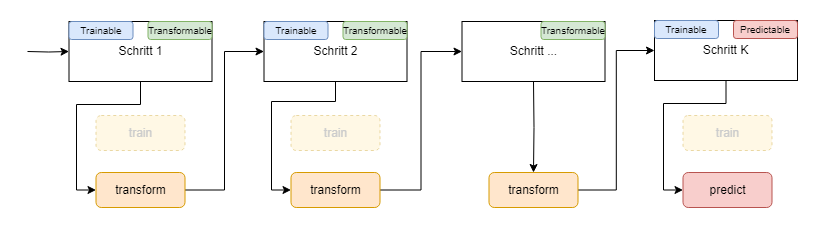

# Technische Details

Die wichtigsten Fähigkeiten der `temibox`-Pipeline sind `Trainable`, `Transformable` und `Predictable`. 
Diese spielen eine zentrale Rolle beim Training und bei der Vorhersage und sind in den meisten Pipelines unverzichtbar. 
Andere Fähigkeiten wie `Cleanable` und `Cacheable` sind nur in bestimmten Situationen erforderlich und ihre Implementierung ist vergleichsweise einfach. 
Hierbei wird der azyklische Abhängigkeitsgraph (DAG) der Pipeline nach Schritten mit der jeweiligen Fähigkeit durchsucht 
und bei jedem Treffer wird die entsprechende Schnittstellen-Methode, wie beispielsweise `.clean()`, ausgeführt. 
Im Gegensatz dazu ist die Ausführung der Methoden `.train()`, `.transform()` und `.predict()` deutlich komplexer.


Wir betrachten in den folgenden Abschnitten als Beispiel diese Klassifizierungspipeline: 

```python
from temibox.pipeline import StandardPipeline
from temibox.trainer import StandardTrainer
from temibox.embedder import BertEmbedder
from temibox.model.classifier import BinaryClassifier

from .domain import MeinDatenlader, MeinAnwendungsfall, MeinDocument

pipeline = (StandardPipeline() \
		.add_usecase(MeinAnwendungsfall())
		.add_step("daten", MeinDatenlader())
		.add_step("embedder", BertEmbedder(pretrained_model_dir = "modelle/distilbert"))
		.add_step("model", BinaryClassifier(multilabel = True
		.add_step("trainer", StandardTrainer()))

pipeline.train(pub_json_pfad = "daten/meinedaten", max_docs = 100_000)
 
pipeline.transform(document = MeinDocument(inhalt = "Das ist nur ein Beispiel"))

pipeline.predict(document = MeinDocument(inhalt = "Das ist nur ein Beispiel"),
                 min_score = 0.75,
                 max_predictions = 10)
```

## Train-Vorgang

Die Grundlage für die Ausführung der `.train()`-Methode bildet der azyklische Abhängigkeitsgraph (DAG) der Pipeline. 
Dieser Graph gewährleistet, dass die einzelnen Schritte in der korrekten Reihenfolge unter Berücksichtigung ihrer Abhängigkeiten ausgeführt werden.



Die `temibox` legt nicht fest, was genau in der `.train()`-Methode geschehen soll. Dies wird von jeder Komponente individuell entschieden. 
Jeder Schritt hat die Möglichkeit, auf die bisher in die Ausführungskette aufgenommenen Eingaben und Transformationen zu reagieren, 
ohne zwingend eine Ausgabe generieren zu müssen. Hier sind einige Beispiele aus den Standardkomponenten:

- `BertEmbedder.train`: Durchläuft alle Trainingsdokumente und nimmt gegebenenfalls neue Tokens auf
- `BinaryClassifier.train`: Baut das neuronale Netz auf, führt jedoch keine Gewichtsoptimierung durch
- `StandardTrainer.train`: Trainiert alle ihm zugeordneten neuronalen Modelle, einschließlich des Embedders

### Beteiligte Schritte an der Train-Methode

Die Schrittkette, die am Trainingsprozess beteiligt ist, umfasst alle Schritte mit den Fähigkeiten `Trainable` und `Transformable`. 

- **Trainable**: Für jeden Schritt in dieser Kette wird überprüft, ob er die Fähigkeit `Trainable` besitzt. 
Ist dies der Fall, wird dessen Methode `.train()` ausgeführt. Dabei kommen zwei Arten von Eingabeparametern zum Einsatz:
     - Direkte Eingabeparameter: Diese Parameter werden direkt an `.train()` übergeben und behalten ihren ursprünglichen Typ. 
Im obigen Beispiel sind `pub_json_pfad` und `max_docs` solche Parameter. 
Sie werden an alle Schritte in genau dieser Form weitergegeben, es sei denn, ein Schritt überschreibt sie mit einer eigenen, gleich benannten Ausgabe.
     - Kontextabhängige Eingabeparameter: Diese Parameter entstehen aus den Ausgaben der vorherigen Transformationsschritte.

- **Transformable**: Falls ein Schritt, dessen `.train()`-Methode gerade ausgeführt wurde, auch die Fähigkeit `Transformable` besitzt, 
wird anschließend seine Methode `.transform()` ausgeführt. Die Ausgaben dieser Methode werden als zusätzliche Parameter aufgenommen. 
Die Eingabeparameter für die `.transform()`-Methode sind dieselben wie für die `.train()`-Methode.

Der Trainings-/Transformationsprozess lässt sich so zusammenfassen:

```python
kwargs = {"original_parameter": 42}

for step in pipeline_steps:
    if isinstance(step, Trainable):
        step.train(**kwargs)
    
    if isinstance(step, Transformable):
        kwargs = {**step.transform(**kwargs), **kwargs}
```


Die Ausgabesignatur der `.transform()`-Methode ist ein Dictionary mit Zeichenkettenschlüssel und einem beliebigen Wert (`dict[str, Any]`). 
Die Ausprägungen der Schlüssel sind von besonderer Bedeutung, da sie als Parameternamen für die nächsten Train- oder Transform-Schritte verwendet werden. 
Da eine Pipeline mehrere Anwendungsfälle gleichzeitig bearbeiten und mehrere Komponenten gleicher Art enthalten kann (z.B. mehrere Embedder), 
wird jeder Wert zusätzlich in einen Wrapper namens `temibox.context.ContextArg` verpackt. 
Dieser Wrapper ermöglicht es, die Ergebnisse weiterzugeben, ohne dass sie von anderen Komponenten überschrieben werden.

Beim Ausführen der `.transform()`-Methode erstellt die Pipeline ein Dictionary mit den für den aktuellen Schritt relevanten Parametern. 
Dabei haben direkte Eingaben Vorrang vor den Ausgaben der Transformationsschritte. 
Das bedeutet, wenn man `pipeline.train(ausgabeort = "out/")` ausführt und zufällig eine Komponente in der Pipeline eine 
Ausgabe mit dem Schlüssel `ausgabeort` erzeugt, z.B. `{"embedding_dim": 768, "ausgabeort": "embedder/tokens"}`, 
wird dem nächsten Schritt dennoch `ausgabeort="out/"` und nicht `ausgabeort="embedder/tokens"` übergeben. 
Daher ist es wichtig, beim Entwurf der Transformationskomponenten auf generische oder von anderen Komponenten verwendete Ausgabebezeichnungen zu verzichten.

Falls der aktuelle Schritt keine `.train()`-Methode besitzt, wird nur die `.transform()`-Methode ausgeführt.


### Struktur der Train-Methode

Der `.train()`-Methode einer Komponente können auch überflüssige Parameter übergeben werden, 
insbesondere wenn die Komponente von einer anderen Komponente abhängt, die viele unterschiedliche Ausgaben erzeugt. 
Daher ist es wichtig, beim Entwurf eigener, individueller Komponenten als letzten Parameter `**kwargs` aufzunehmen. 
Hier ist ein Beispiel für die Umsetzung:

```python
from temibox.traits import Trainable
from temibox.context import Context, ContextArg
from typing import Optional


class MeineKomponente(Trainable): 
    
    def train(self, 
              ctx: Optional[Context] = None,
              original_parameter: int = 42,
              parameter_1: ContextArg[str] = "",
              parameter_2: ContextArg[str] | None = None,
              **kwargs) -> None:
        pass
```

Die Signatur der Beispielimplementierung der `.train()`-Methode kommuniziert folgende Punkte:
- Der Pipeline-Kontext ist optional.
- Der `.train()`-Methode muss der Parameter `original_parameter` beim Aufrufen von `Pipeline.train` übergeben werden. 
Dies erkennt man daran, dass der Typ des Parameters direkt angegeben ist (`int` und nicht `ContextArg[int]`).
- Die Parameter `parameter_1` und `parameter_2` werden von einem der Transformationsschritte erzeugt und an weitere Schritte weitergegeben.
- Der Dictionary-Parameter **kwargs nimmt alle überflüssigen Schlüsselwort-Parameter auf und verhindert so, 
dass das Programm aufgrund überflüssiger Parametereingaben abbricht. 


Falls die Methode auch dann funktionieren soll, wenn es keinen Schritt in der Pipeline gibt, der diese Parameter erzeugt, 
wird dies häufig in der `.train()`-Methode wie folgt dargestellt:

```python 
def train(self, 
          ctx: Optional[Context] = None,
          document: Document | ContextArg[Document] | None = None,
          documents: list[Document] | ContextArg[list[Document]] | None = None,
          **kwargs):
    pass 
```

Hier akzeptiert die Methode ein oder mehrere Dokumente, die entweder direkt übergeben oder von einem der Transformationsschritte erzeugt werden. 
Damit können im Trainingsprozess die Modelle anhand der geladenen Trainingsdokumente trainiert (Parameter aus einer "Transformation") 
und für die Vorhersage ein oder mehrere Dokumente direkt eingegeben werden. 
Es muss jedoch sichergestellt werden, dass keine der Komponenten die direkt eingegebenen Parameter überschreibt.

### Kontextabhängige Parameter

Der Parameter-Wrapper `temibox.context.ContextArg` ermöglicht die Nutzung mehrerer Anwendungsfälle innerhalb einer Pipeline. 
Ein in diesem Wrapper verpackter Parameter hat die Signatur `ContextArg[T]`, 
wobei `T` ein beliebiger Typ sein kann (`int`, `Embedder`, `tuple[bool, list[int]]`, usw.). 

Um den Inhalt des Wrappers zu extrahieren, verwendet man den Befehl `ContextArg.extract(obj, usecase_name)`. 
Hierbei entspricht `obj` der verpackten Variable und `usecase_name` der Bezeichnung des Anwendungsfalls bzw. des Kontexts.
Falls die Pipeline nur einen Anwendungsfall enthält oder der Parameterwert für alle Anwendungsfälle gleich sein soll 
(z.B. eine Liste von Trainingsdokumenten), kann auch die verkürzte Form `ContextArg.extract(obj)` verwendet werden.


## Predict-Vorgang

Die Methode `.predict()` verläuft logischerweise anders als die `.train()`-Methode. 
Zunächst werden, nach dem gleichen Schema wie im Trainingsvorgang, der Reihe nach (gemäß des DAG) alle Transformationsschritte ausgeführt. 
Die Ausgaben der früheren Schritte werden zusammen mit den direkten Eingaben als Eingaben für die späteren Schritte verwendet. 
Nach dem letzten Transformationsschritt werden die Komponenten mit der Fähigkeit `Predictable` ausgeführt.



Im Gegensatz zu den Transformationsschritten werden die früheren Vorhersagen nicht als Eingaben für die späteren Vorhersageschritte verwendet. 

Möchte man ein Ensemble-Modell erstellen, bei dem die Eingaben aus den Vorhersagen anderer Modelle bestehen, 
könnte man eine neue Modellart mit den Fähigkeiten `Trainable`, `Predictable` und `Supervising` implementieren. 
Über die Methode `Supervising.supervise` wird das neue Modell darüber informiert, 
welche "einfachen" Modelle es überwachen und deren Prognosen verwenden soll. 
Um kombinierte Vorhersagen zu erzeugen, würde ein solches Modell die Prognosen jedes einzelnen überwachten Modells erzeugen 
und sie auf sinnvolle Weise kombinieren, beispielsweise:

```python
from temibox.pipeline import StandardPipeline
from temibox.trainer import StandardTrainer
from temibox.embedder import BertEmbedder
from temibox.model.classifier import BinaryClassifier

from .domain import MeinDatenlader, MeinAnwendungsfall, MeinDocument, EnsembleModel

pipeline = (StandardPipeline() \
                .add_usecase(MeinAnwendungsfall())
                .add_step("daten", MeinDatenlader())
                .add_step("embedder", BertEmbedder(pretrained_model_dir = "modelle/distilbert"))
                
                # Einfache Modelle
                .add_step("model-1", BinaryClassifier(multilabel = True))
                .add_step("model-2", BinaryClassifier(multilabel = True))
                .add_step("model-3", BinaryClassifier(multilabel = True))
                .add_step("trainer", StandardTrainer())
                          
                # Ensemble Modell
                .add_step("ensemble", EnsembleModel(multilabel = True), dependencies = ["model-1", 
                                                                                        "model-2",
                                                                                        "model-3"])
                .add_step("trainer", StandardTrainer(), dependencies = ["daten", "ensemble"]))

pipeline.train(pub_json_pfad = "daten/meinedaten")

pipeline.predict(document = MeinDocument(inhalt = "Das ist nur ein Beispiel"),
                 min_score = 0.75,
                 max_predictions = 10)
```

### Struktur der Predict-Methode

Wenn die Pipeline Komponenten mit der Fähigkeit `Predictable` enthält, können Vorhersagen mit dem Pipeline-Befehl
`pipeline.predict` erzeugt werden. Welche Parameter dieser Befehl akzeptiert, hängt unter anderem von den in der Pipeline enthaltenen
Komponenten ab. 

Die Signatur des Befehls kann mit `pipeline.get_signature(Predictable, as_string = True)` ausgegeben werden. 
Sie listet die Gesamtheit der Parameter aller im Berechnungspfad involvierten Komponenten auf,
beispielsweise:

```python
PREDICT:
	binary_threshold    : float = 0.5
	document            : Union[Document, ContextArg[Document]] = None
	documents           : Union[list[Document], ContextArg[list[Document]]] = None
	embeddings          : Union[torch.FloatTensor, ContextArg[torch.FloatTensor]] = None
	label_dict          : Union[dict[int, Union[int, str]], ContextArg[dict[int, Union[int, str]]]] = {}
	max_predictions     : int = 10
	min_score           : float = 0.0
```

Beachten Sie:
- Parameter vom Typ `ContextArg` sind kontextbasiert, das heißt, sie können auch von einer der im Pfad enthaltenen Transformationskomponenten gesetzt werden.
- Parameter ohne diesen Typ sind direkte Parameter und müssen direkt beim Aufruf des Pipeline-Befehls `pipeline.predict` übergeben werden.

Das Ergebnis von `pipeline.predict(documents = liste_mit_dokumenten)` sind eine oder mehrere Instanzen des Typs `pipeline.prediction.Prediction` 
pro Dokument (entsprechend der Länge von `liste_mit_dokumenten`) und Anwendungsfall, abhängig davon, wie viele Prädiktoren die Pipeline enthält. 
Eine Vorhersage enthält verschiedene Meta-Informationen wie Zeitstempel, Bezeichnung des Anwendungsfalls und des Modells, 
sowie einen DataFrame mit Prognosen und eine Liste mit Roh-Prognosen (`temibox.prediction.RawPrediction`) für jede Ausprägung der Zielvariable.