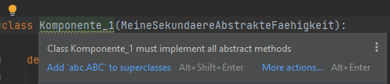
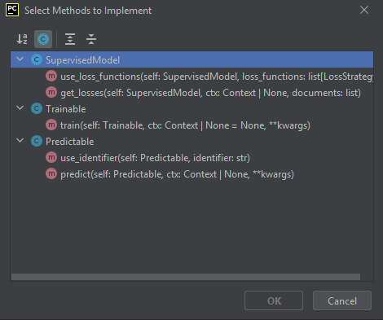
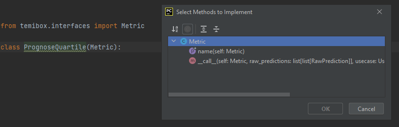
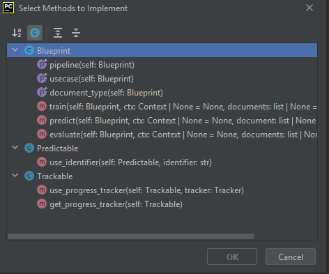

# Weiterentwicklung

Alle Komponenten und Vorgänge der `temibox`, einschließlich der Pipelineausführungslogik, können individuell angepasst und erweitert werden. 
Dazu erbt man eine oder mehrere `temibox`-Fähigkeiten oder Schnittstellen und implementiert die darin definierten Methoden.

## Fähigkeiten

* Primäre Fähigkeiten (`temibox.traits`) - relevant auf Pipelineebene
  * `Trainable` - kann trainieren
  * `Transformable` - kann transformieren
  * `Predictable` - kann vorhersagen
  * `Cleanable` - kann / soll bereinigt werden
  * `Cacheable` - kann sich Ausgaben merken
  * `Trackable` - kann verfolgt werden
  * `Evaluating` - kann Test-Metriken berechnen 
  * `Supervising` - kann andere Komponenten supervidieren
* Sekundäre Fähigkeiten (`temibox.capabilities`) - relevant auf Komponentenebene
  * `CudaCapable` - kann die GPU nutzen
  * `InferenceCapable` - unterscheidet zwischen Training und Evaluation
  * `ParameterCapable` - ist parametrisierbar
  * `NeuralModel` - ist ein neuronales Modell (besitzt Methode `forward`)
  * `BinaryNeuralModel` - klassifiziert Ja/Nein
  * `MultilabelBinaryNeuralModel` - klassifiziert Ja/Nein im One-vs-Rest Modus
  * `MultinomialNeuralModel` - klassifiziert in eine aus mehr als zwei Klassen 
  * `MultilabelNeuralModel` - klassifiziert in eine oder mehrere aus mehr als zwei Klassen 

Klassen mit primären Fähigkeiten können als Schritte aufgenommen werden (`pipeline.add_step`).

### Zusätzliche primäre Fähigkeiten

Jede Klasse, die die abstrakte Klasse `temibox.traits.PipelineStep` erbt, gilt als primäre Fähigkeit:
```python
from abc import ABCMeta
from temibox.traits import PipelineStep

class NeueFaehigkeit(PipelineStep, metaclass=ABCMeta):
    
    def sag_hallo(self, name: str):
        raise NotImplementedError("Fähigkeit muss implementiert werden")
```

Da die primäre Fähigkeit in der Regel abstrakt ist, kann sie nicht direkt verwendet werden.
Stattdessen implementiert man eine neue Komponente, die diese Fähigkeit besitzt:

```python
class NeueKomponente(NeueFaehigkeit):
  
    def sag_hallo(self, name: str):
        print(f"Hallo, ich heiße {name}!")
```

Die neue Komponente kann nun als Pipeline-Schritt verwendet werden:
```python
from temibox.pipeline import StandardPipeline
from .domain import MeinAnwendungsfall

pipeline = (StandardPipeline 
                .add_usecase(MeinAnwendungsfall())
                .add_step("beispiel", NeueKomponente()))
```

Das allein reicht jedoch nicht aus, da die `StandardPipeline` keinen Workflow für die neue Fähigkeit bzw. die Methode `sag_hallo` enthält. 
Um dies zu ermöglichen, muss man entweder die bestehende Pipeline-Komponente erweitern oder eine neue `Pipeline`-Klasse implementieren, zum Beispiel:

```python
from temibox.pipeline import StandardPipeline

class NeuePipeline(StandardPipeline, NeueFaehigkeit):
  
    def __init__(self):
        super().__init__()

    def sag_hallo(self):
        for name, step in self._dag.walk(predicate=lambda x: isinstance(x, NeueFaehigkeit)):
          step.sag_hallo(name)

```

### Zusätzliche sekundäre Fähigkeiten

Bei den sekundären Fähigkeiten gestaltet sich die Situation einfacher, da diese oft direkt in den Komponenten 
und nicht in der Pipeline benötigt werden, zum Beispiel:

```python
from abc  import ABCMeta
from typing import Protocol, runtime_checkable

class MeineSekundaereAbstrakteFaehigkeit(metaclass=ABCMeta):
    def tue_etwas(self):
        raise NotImplementedError("Schnitstellenmethode muss implementiert werden")
    
@runtime_checkable
class MeineSekundaereImpliziteFaehigkeit(Protocol):
    def tue_etwas(self):
        pass
```


Es gibt mehrere Möglichkeiten, eine sekundäre Fähigkeit zu definieren:
- abstrakte Klasse (`MeineSekundaereAbstrakteFaehigkeit(metaclass=ABCMeta)`): 
Um eine durch eine abstrakte Klasse definierte Fähigkeit zu besitzen, muss die Komponente diese Klasse erben.
- implizite Schnittstelle (`MeineSekundaereImpliziteFaehigkeit(typing.Protocol)`): Implementieren der Methode `tue_etwas` (ist in beiden Fällen erforderlich).

Für sekundäre Fähigkeiten ist die implizite Schnittstelle oft bequemer. 
Der einzige Nachteil besteht darin, dass wir nicht sofort bemerken würden, 
wenn sich die Definition der Fähigkeit ändert und unsere neue Komponente die Schnittstelle nicht mehr erfüllt. 
Ein Python-Linter würde jedoch bei fehlender Implementierung abstrakter Methoden eine Warnung ausgeben.



## Schnittstellen

Folgende Schnittstellen sind für die Erweiterung von `temibox` verfügbar:

* NLP-Komponenten
  * `Preprocessor` - Text-Präprozessor
  * `Tokenizer` - Tokenizer (`Zeichenkete -> Tokens`)
  * `Vectorizer` - Vectorizer (`Tokens -> numerische Vektoren`)
  * `Embedder` - Embedder (`Zeichenkette -> numerische Vektoren`)
* Modelle und Training
  * `Trainer` - Trainer für neuronale Netze
  * `Classifier` - Textklassifizierer
  * `Searcher` - Semantische Suchmaschine
  * `Summarizer` - Zusammenfasser
  * `SupervisedModel` - Allgemeines Modell (Modell mit Zielvariable)
  * `LossStrategy` - Verlustfunktion für das Training
  * `Metric` - Performancemetrik für die Evaluation
* Fachdomäne
  * `Document` - Dokument (Platzhaltertyp)
  * `Label` - Zielvariable (Platzhaltertyp)
  * `UseCase` - Anwendungsfall
  * `DocumentLoader` - Dokumentenlader (Platzhaltertyp)
* Meta
  * `Pipeline` - Pipeline
  * `Blueprint` - Vorlage


## Individuelle Komponenten erstellen

Zum Erzeugen einer individuellen Komponente erstellen Sie eine neue Klasse und implementieren die von den Fähigkeiten oder Schnittstellen geerbten Methoden. 
Dafür sind folgende Schnittstellen und abstrakten Klassen wichtig:

```python
# Schnittstellen der wichtigsten Komponenten:
from temibox.interfaces import Pipeline, Trainer, SupervisedModel, Classifier, Embedder

# Primäre Fähigkeiten (damit Komponente als Pipeline-Schritt betrachtet werden kann):
from temibox.traits import Trainable, Transformable, Predictable, Cleanable, Cacheable, Trackable

# Sekundäre Fähigkeiten (beschreiben interne Fähigkeiten der Komponenten):
from temibox.capabilities import InferenceCapable, CudaCapable, ParameterCapable 
```


### Neuen Klassifizierer erstellen

Als Beispiel erzeugen wir eine neue Art von Klassifizierer. Unsere neue Komponente muss die Schnittstelle 
`temibox.interfaces.Classifier` erben und die abstrakten Methoden implementieren:



Man erkennt, dass die Klasse `Classifier` aus drei weiteren Klassen besteht: `SupervisedModel`, `Trainable` und `Predictable`. 
Damit die neue Komponente als Klassifizierer verwendet werden kann, müssen auch die Methoden dieser Klassen implementiert werden.

```python
import torch
from typing import Optional

from temibox.context import Context
from temibox.domain import Document
from temibox.prediction import Prediction
from temibox.interfaces import Classifier, LossStrategy

class MyModel(Classifier):

    def use_identifier(self, identifier: str):
        <-- Implementierung -->
    
    def use_loss_functions(self, loss_functions: list[LossStrategy]):
        <-- Implementierung -->

    def get_losses(self, ctx: Optional[Context], documents: list[Document]) -> list[torch.Tensor]:
        <-- Implementierung -->

    def train(self, ctx: Optional[Context] = None, **kwargs) -> None:
        <-- Implementierung -->    

    def predict(self, ctx: Optional[Context], **kwargs) -> list[Prediction]:
        <-- Implementierung -->
```

### Neue Metrik erstellen

Als weiteres Beispiel zeigen wir die Implementierung einer neuen Metrik, die die Quartile der prognostizierten
Scores berechnet. Beim Erstellen der neuen Klasse erhalten wir eine Warnung, dass die abstrakten Methoden der Klasse `Metric` implementiert werden müssen:



Hier ist eine mögliche Implementierung der fehlenden Methoden:

```python
from temibox.interfaces import Metric
from temibox.prediction import RawPrediction
from temibox.domain import UseCase, Document

import numpy as np
from typing import Any
from pandas import DataFrame

class PrognoseQuartile(Metric):
  
    @property
    def name(self) -> str:
        return "prognose-quartile"

    def __call__(self, 
                 raw_predictions: list[list[RawPrediction]], 
                 usecase: UseCase, 
                 documents: list[Document],
                 return_dataframe: bool = False, 
                 **kwargs) -> Any:
        
        quartile = [0.25, 0.50, 0.75]
        result = np.quantile([x.score for r in raw_predictions for x in r], quartile)

        if return_dataframe:
          return DataFrame({"quartil": quartile, 
                            "wert": result})
        
        return "\n".join([f"Q{q:.0%}: {r:.2f}" for q,r in zip(quartile, result)])
    
```


### Eigene Blueprints erstellen

Die Entwicklung einer eigenen Vorlage (`Blueprint`) erfordert die Definition aller relevanten Bestandteile 
einer funktionierenden Pipeline zur Fachdomäne (wie Dokumententyp oder Anwendungsfall) und zur Technik (relevante zusätzliche Komponenten, Pipelineschritte).

Die Vorlage wird erstellt, indem eine neue Klasse die Vorlagenklasse `temibox.interfaces.Blueprint` erbt 
und die darin definierten abstrakten Methoden implementiert:



Eine neue Vorlage könnte dementsprechend so strukturiert sein:

````python
from temibox.interfaces import Blueprint, Pipeline
from temibox.domain import Document, UseCase
from temibox.context import Context
from temibox.tracker import Tracker
from temibox.prediction import Prediction

from typing import Optional, Type


class MeineVorlage(Blueprint):

    def __init__(self):
        super().__init__()        
    
    @property
    def pipeline(self) -> Pipeline:
        pass

    @property
    def usecase(self) -> UseCase:
        pass

    @property
    def document_type(self) -> Type[Document]:
        pass

    def train(self, ctx: Optional[Context] = None, documents: list[Document] = None, **kwargs):
        pass

    def predict(self, ctx: Optional[Context] = None, document: Document | list[Document] = None, **kwargs) -> list[
        Prediction]:
        pass

    def evaluate(self, ctx: Optional[Context] = None, documents: list[Document] = None, **kwargs) -> list[str]:
        pass

    def use_identifier(self, identifier: str):
        pass

    def use_progress_tracker(self, tracker: Tracker) -> None:
        pass

    def get_progress_tracker(self) -> Tracker:
        pass
````

